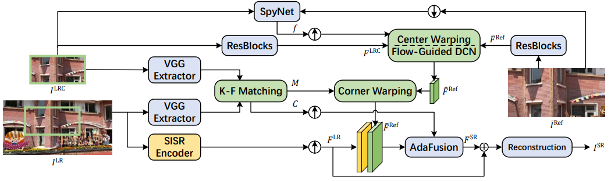

# KeDuSR (AAAI 2024)
This repository contains official implementation of our AAAI 2024 paper "KeDuSR: Real-World Dual-Lens Super-Resolution via Kernel-Free Matching", by Huanjing Yue, Zifan Cui, Kun Li, and Jingyu Yang.

[paper](https://arxiv.org/abs/2312.17050) | [dataset](https://drive.google.com/file/d/1ByX75-wKriw7a8PBwhUwllcXn2891eqi/view?usp=sharing) | [results](https://drive.google.com/file/d/1SFL7cO_22pSiYDS070gxkpClb6Vg2NPk/view?usp=sharing) | [pre-trained model](https://drive.google.com/file/d/1qpGaIZwh82veJhDHEZGj_dcZv2ao7y6Q/view?usp=sharing)

You can download the above-mentioned resources from [Baidu Netdisk](https://pan.baidu.com/share/init?surl=4bAHsejE1hUAc2ubppqFwQ&pwd=jnjy), or [Google Drive](https://drive.google.com/drive/folders/1kmPrDCNG_F9X9iDhmD4VVIWAeJH6JW1b?usp=sharing). 

## Introduction
We propose a kernel-free matching strategy by matching between LR-center and LR-corner, which avoids the resolution gap between the LR and Ref in Dual-Lens Reference-Based SR task.



## Dataset

We constructed the first well-aligned Dual-Lens SR dataset, DuSR-Real.

We further apply the same processing approach on the [CameraFusion](https://github.com/Tengfei-Wang/DCSR/tree/master) and [RealMCVSR](https://github.com/codeslake/RefVSR), to generate well-aligned real LR-HR pairs and the pairs that cannot be well aligned are removed. The reorganized datasets are named CameraFusion-Real and RealMCVSR-Real, respectively.

#### Copyright

The dataset is available for the academic purpose only. Any researcher who uses the dataset should obey the licence as below:

All of the Dataset are copyright by [Intelligent Imaging and Reconstruction Laboratory](http://tju.iirlab.org/doku.php), Tianjin University and published under the Creative Commons Attribution-NonCommercial-ShareAlike 4.0 License. This means that you must attribute the work in the manner specified by the authors, you may not use this work for commercial purposes and if you alter, transform, or build upon this work, you may distribute the resulting work only under the same license.

## Dependencies

- Python 3.10.8 and Pytorch 2.0.0, other versions are also acceptable.
- tqdm, lpips, numpy, opencv-contrib-python, tensorboardX.
- NVIDIA 3090 24G.

## Quick Start
Download the dataset and the pre-trained models, place them as follows:

```
KeDuSR
├── dataset
│   ├── DuSR-Real
│   ├── RealMCVSR-Real
│   └── CameraFusion-Real
└── pre-trained
    ├── xxx.pth
    ├── xxx.pth
    └── ...
```

For quick test on DuSR-Real, run the scipts:

```python
# only reconstruction loss (DuSR-Real)
python test.py --dataset_root dataset --dataset_name DuSR-Real --resume pre-trained/DuSR-Real_220000.pth

# hybrid loss (DuSR-Real)
python test.py --dataset_root dataset --dataset_name DuSR-Real --resume pre-trained/DuSR-Real_GAN_180000.pth

# Calculate LPIPS
python LPIPS_metric.py --SR_dir DuSR-Real_220000 --HR_dir dataset/DuSR-Real/test/HR

```

## Training

To train the KeDuSR model on DuSR-Real, run the scipts:

```
# only reconstruction loss (DuSR-Real)
python train.py --dataset_root dataset --dataset_name DuSR-Real --use_tb_logger --loss_Charbonnier

# hybrid loss (DuSR-Real)
python train.py --dataset_root dataset --dataset_name DuSR-Real --use_tb_logger --loss_Charbonnier --loss_perceptual --loss_adv

#Resume Training
python train.py --dataset_root dataset --dataset_name DuSR-Real --use_tb_logger --loss_Charbonnier --resume weights/20240117_232231/snapshot/net_xxx.pth --resume_optim weights/20240117_232231/snapshot/optimizer_G_xxx.pth --resume_scheduler weights/20240117_232231/snapshot/scheduler_xxx.pth

```

## Citation

If you find this work useful for your research, please cite:

```
@article{yue2023kedusr,
  title={KeDuSR: Real-World Dual-Lens Super-Resolution via Kernel-Free Matching},
  author={Yue, Huanjing and Cui, Zifan and Li, Kun and Yang, Jingyu},
  journal={arXiv preprint arXiv:2312.17050},
  year={2023}
}
```

## Acknowledgement

We thank the authors of [TTSR](https://github.com/researchmm/TTSR), [DCSR](https://github.com/Tengfei-Wang/DCSR/tree/master), [MASA](https://github.com/dvlab-research/MASA-SR) and for sharing their codes.

